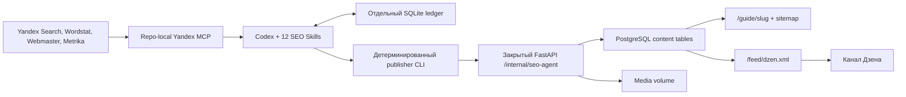

# Production-контур SEO-статей VedicWay

Дата ревизии: 21 июля 2026 года. Исходный контур: `D:\IVAN-SEO-HERMES-TEST-true`. Целевой проект: `D:\CODEX_WORK\VedicWay`.

## Что готово

VedicWay получил автономный article-only контур вокруг Codex. Он собирает спрос Яндекса, превращает подтвержденные запросы в брифы, пишет и проверяет статьи, публикует их в разделе `/guide`, отдает полный RSS для Дзена и возвращается к опубликованным URL по данным Webmaster и Metrika. Социальные сети, vc.ru, Joomla, VirtueMart, Pinterest, Telegram и универсальные cross-posting модули исключены.

Служебная память вынесена в отдельный SQLite `vedicway_seo_agent.sqlite3`. Агент не получает пароль PostgreSQL, сеть `data`, административные cookie или доступ к таблицам пользователей, платежей и натальных карт. Бэкенд принимает только изображения и готовые статьи через закрытый bearer API. Nginx продолжает отвечать 404 на публичный `/internal/*`.

Код готов к production-активации после добавления VedicWay-only доступов из [OPEN_GATES_RU.md](../seo_agent/OPEN_GATES_RU.md). Токены проекта Ивана не использовались ни для исследования, ни для тестов, ни для конфигурации.

## Что показал полный разбор Hermes

В исходной директории я проинвентаризировал 6147 файлов, 45 Skills, scheduler, 4 Yandex MCP, Joomla/Dzen publishing, SQLite-ledger, миграции, тесты и сохраненные браузерные профили. Рабочая БД Hermes прошла `integrity_check=ok`, `foreign_key_check=0`, содержала 25 миграций и schema version 2.3.0. Операционные таблицы были пусты, поэтому переносить сам файл или его историю в VedicWay не было смысла.

Главная ценность Hermes лежала в дисциплине состояний: один владелец записи в БД, аренда задач, attempt token, idempotency key, terminal evidence, неизменяемый slug и обязательная публичная проверка после публикации. Его предметная модель была тесно связана с мебельным каталогом, Joomla и социальными сетями. Прямое копирование принесло бы 66 таблиц и 10 cron-job, из которых VedicWay использовал бы меньше половины.

| Узел Hermes | Решение для VedicWay | Причина |
|---|---|---|
| Yandex Search, Wordstat, Webmaster, Metrika | Сохранен и изолирован в repo-local MCP | Эти четыре источника закрывают спрос, выдачу, индексирование и органические визиты |
| Ledger, claims, runs, policy decisions, evidence | Переписан в компактную отдельную БД | Нужны строгие состояния без мебельной и социальной предметной области |
| Brief, writer, Russian edit, audit, lifecycle | Адаптированы в 12 Skills | Каждый Skill получил одну роль и минимальные полномочия |
| Joomla publisher и медиа-порядок Joomla | Заменены внутренним FastAPI | Сайт уже хранит статьи в PostgreSQL и отдает server-rendered HTML |
| Dzen Playwright publisher | Заменен официальным RSS | Регулярный браузерный вход хрупок; RSS дает стабильную доставку и draft-режим |
| VirtueMart, Pinterest, Telegram, MAX, VK, social queue | Удалены из контура | Пользователь запретил социальные сети, а каталог мебели к VedicWay не относится |

Полная сверка 45 исходных Skills дала пять непересекающихся групп. В первую вошла предметно полезная логика, которую я переписал под VedicWay: `article-humanizer-ru`, `article-image-candidate-finder`, `article-lifecycle-monitor`, `article-ru-text`, `content-brief-builder`, `optimization-action-runner`, `performance-diagnoser`, `platform-article-auditor`, `platform-article-writer`, `seo-db-ledger`, `seo-policy-guard`, `serp-cluster-prioritizer`, `yandex-schema`, `yandex-signal-collector`.

Три Skills заменены целевыми механизмами сайта: `joomla-publish-gate` стал закрытым FastAPI, `dzen-playwright-publisher` стал RSS, `published-media-cleanup` уступил транзакционному media storage и существующему удалению только незадействованных assets. Восемь мебельных и Pinterest Skills удалены: `catalog-commercial-mapper` и семь `pinterest-*`. Девятнадцать social/TenChat Skills удалены вместе с их очередями и публикационными ledger. `playwright-cli` не входит в production-контур, потому что штатная публикация больше не зависит от браузерной сессии.

## Архитектура



Scheduler и Codex работают в сервисе `seo-agent` из Compose profile `seo`. У сервиса две сети: внутренняя `edge` для обращения к backend и отдельная `seo-egress` для OpenAI с Яндексом. Сети `data`, `api-egress`, `worker-egress` ему не выданы. Backend видит только внутренний SEO bearer token; Codex key и Yandex OAuth-токены в API не монтируются.

Образ запускает процессы от UID 10001, оставляет root filesystem read-only и хранит изменяемое состояние в `seo_agent_data` и `seo_codex_home`. В образ попадают 12 SEO Skills, расчетный `vedic-astrology`, `.codex/config.toml`, код `seo_agent`, четыре pinned npm-пакета MCP и два отслеживаемых seed-файла из `seo/yandex`. Остальные repo-local Skills в runtime не копируются.

## База агента

Миграция [001_initial.sql](../seo_agent/migrations/001_initial.sql) создает 19 STRICT-таблиц, четыре operational view и trigger защиты terminal publication. [002_claim_run_ownership.sql](../seo_agent/migrations/002_claim_run_ownership.sql) связывает аренды с их `cron_run`, чтобы авария или ложный completed-run немедленно возвращали незавершенную сущность в очередь. SQLite работает с foreign keys, WAL, `synchronous=FULL`, `busy_timeout=30s` и неизменяемыми checksum миграций. Путь БД обязан лежать внутри `VEDICWAY_SEO_DATA_DIR`; попытка открыть произвольный SQLite отклоняется.

Контур хранит четыре класса данных. Источники и сырые MCP-ответы дают воспроизводимое evidence. Keyword queries, SERP snapshots и clusters описывают поисковый спрос. Briefs, drafts и media ведут производство статьи. Attempts, publications, performance snapshots и optimization actions замыкают публикацию с последующим улучшением. Cron runs, skill runs, job results и audit events отвечают за эксплуатацию.

`python -m seo_agent.cli` остается единственным разрешенным writer. Он умеет инициализировать и проверять БД, создавать run, продлевать lease, атомарно claim-ить cluster/draft/action, записывать типизированные сущности, делать online backup и завершать run. Scheduler признает успех только при одной durable-записи `job_results`; нулевой exit code Codex без результата превращается в `RESULT_MISSING`.

Статусы публикации не могут откатиться из `published` или `verified` в промежуточное состояние, а `verified` не возвращается в `published`. Publication создается после конкретного terminal attempt `succeeded`, совпадения draft content hash, request hash, claim token и семи публичных проверок. Параллельные workers не получают одну сущность: `BEGIN IMMEDIATE`, claim token и срок аренды дают одного победителя. Аренда автоматически равна job timeout плюс 300 секунд, при стандартном часе это 3900 секунд. Claim хранит `cron_run_id`; завершение с ошибкой освобождает его сразу, а completed-run с незакрытой сущностью получает `CLAIM_UNFINISHED` вместо ложного успеха.

## Scheduler

В [job_specs.json](../seo_agent/job_specs.json) осталось пять заданий.

| Job | Интервал | Результат |
|---|---:|---|
| `article_intelligence_refresh` | 7 дней | свежие Yandex signals, queries и ranked clusters |
| `article_content_production` | 48 часов | один brief, draft, media package и quality report |
| `article_optimization` | 24 часа | исполнение одной доказанной lifecycle-задачи под прежним slug |
| `article_site_publish` | 60 минут | одна проверенная публикация на сайте и присутствие в RSS |
| `article_lifecycle_review` | 7 дней | performance snapshot и измеримые optimization actions |

Scheduler передает промпт через stdin в `codex exec`, использует configured model/reasoning/service tier, ephemeral-сессию, strict config, `--ignore-user-config` и sandbox `workspace-write` с единственным дополнительным writable-каталогом SEO-data. Контейнерный root filesystem остается read-only. Scheduler поддерживает heartbeat каждые 20 секунд и убивает процесс после `VEDICWAY_SEO_JOB_TIMEOUT_SECONDS`. После аварии контейнера протухший `running` снова попадает в due-очередь, а новый запуск атомарно помечает прежнюю аренду как `STALE_LEASE`. Failed run повторяется через 15 минут, blocked run через 6 часов. Completed и обоснованный skipped ждут штатный интервал. Обычная нехватка результата не считается успешным no-op.

При первом старте локальный bootstrap загружает текущий `keyword-demand.csv` и `serp-evidence.md` без внешних вызовов. Он создает 16 seed-запросов и два готовых article cluster: дома натальной карты с зафиксированным спросом 146 запросов в месяц и аспекты натальной карты со спросом 62. Эти числа относятся к региону Россия, снимку 19 июля 2026 года и должны обновиться через Wordstat до создания брифа, если возраст превысит 30 дней. Запрос `гид по астрологии` с двумя показами не используется как primary keyword.

## Skills как основной операционный слой

| Skill | Полномочие |
|---|---|
| `vedicway-seo-ledger` | runs, claims, типизированные записи и durable result |
| `vedicway-yandex-signals` | четыре Yandex MCP с обязательной сверкой host/counter |
| `vedicway-topic-planner` | кластеризация, каннибализация и priority score |
| `vedicway-content-brief` | evidence-backed outline и ограничения claims |
| `vedicway-article-writer` | первый Markdown draft по одобренному brief |
| `vedicway-article-editor-ru` | плотная русская редактура без новых фактов |
| `vedicway-article-quality-gate` | автоматический и ручной release gate |
| `vedicway-article-media` | owned/licensed/generated assets с SHA-256 и лицензией |
| `vedicway-article-optimizer` | исполнение action, повторный gate и проверенная ревизия под тем же URL |
| `vedicway-site-publisher` | внутренний API и публичная верификация |
| `vedicway-dzen-distributor` | RSS readiness и факт появления в канале |
| `vedicway-lifecycle-review` | Webmaster/Metrika snapshot и измеримые действия |

Skills не дублируют код. Детерминированные операции лежат в CLI-модулях: `db.py`, `quality_gate.py`, `media.py`, `site_client.py`, `preflight.py`, `backup.py`. Skill объясняет, когда и с какими ограничениями вызвать инструмент; Python проверяет путь, hash, размер, transition и HTTP evidence. Lifecycle-run только создает измеримое action. Отдельный optimization-run меняет опубликованный draft по действующей аренде, проводит новый gate, обновляет тот же URL и закрывает action после появления нового verified request hash.

## Защита от чужого Yandex-проекта

Repo-local `.codex/config.toml` содержит ровно четыре сервера с префиксом `vedicway-`: Search 1.3.0, Wordstat 2.0.0, Webmaster 1.1.0 и Metrika 1.1.0. Версии и integrity зафиксированы в `package-lock.json`; Joomla и все social publishers отсутствуют. Launcher принимает только секреты `VEDICWAY_YANDEX_*`, удаляет из дочерней среды любые унаследованные `YANDEX_*` и лишь затем передает пакетам ожидаемые ими имена.

На рабочей Windows-машине `codex mcp list` показывает также глобальные MCP проекта Ивана. Production scheduler передает `--ignore-user-config`, работает под отдельным томом `seo_codex_home` и через четыре строгих `--config` явно регистрирует только VedicWay Yandex MCP. Это существенно: пустой изолированный `CODEX_HOME` сам по себе не загружает репозиторный `.codex/config.toml`. Preflight требует буквального совпадения `CODEX_HOME` и `VEDICWAY_SEO_CODEX_HOME`, а каждый VedicWay launcher дополнительно отбрасывает общие `YANDEX_*`. Локально запускать scheduler из обычного пользовательского `CODEX_HOME` запрещено и технически блокируется в production-режиме.

Перед любым Webmaster report Skill вызывает `list_hosts` и требует точного совпадения с `VEDICWAY_YANDEX_HOST_ID` и доменом VedicWay. Перед Metrika report он вызывает `get_counters` и сравнивает numeric ID с `VEDICWAY_METRIKA_COUNTER_ID`. Ноль совпадений и несколько совпадений блокируют run. Значение из чужого аккаунта не сохраняется как сигнал. `check_seo_agent_release.py` дополнительно требует, чтобы ID Metrika совпал с `VITE_YANDEX_METRIKA_ID` frontend-сборки.

Search и Wordstat работают с одним VedicWay Search API key и folder ID. Внутри изолированного дочернего процесса Wordstat получает их под именами `YANDEX_SEARCH_API_KEY` и `YANDEX_FOLDER_ID`, поэтому отдельный второй cloud key не нужен. Context7 подтвердил для официального Yandex Search MCP требование Search API key, folder ID и роль Search API для service account; имена переменных у локально закрепленного npm-сервера проверены по его исходникам.

## Редакционный gate для Яндекса

Яндекс относит автоматически сгенерированные тексты без анализа и редактуры, повторы, выдуманные факты и страницы без практической ценности к малополезному контенту. Отдельное нарушение создает текст, написанный ради поискового робота и перенасыщенный запросами. Поэтому production gate запрещает серийные тонкие страницы, обещания точного будущего и механические комбинации всех планет со всеми домами. Правила взяты из официальных разделов [малополезный контент](https://yandex.ru/support/webmaster/ru/threat/useless-content), [SEO-тексты](https://yandex.ru/support/webmaster/ru/threat/seo-text), [советы Вебмастера](https://yandex.ru/support/webmaster/ru/yandex-indexing/webmaster-advice) и [оценка качества EPOS](https://yandex.ru/support/webmaster/ru/epos).

Автоматический `quality_gate` требует 4500-30000 знаков, нормальную длину title/meta/excerpt, минимум три H2, две внутренние ссылки, переход к расчету карты, две внешние ссылки на источники, cover и полную атрибуцию media. Он считает плотность focus keyphrase, ищет повторенные абзацы и блокирует гарантированные предсказания с медицинскими claims. После него Skill вручную сверяет статью с brief и источниками; автоматический pass без этой проверки не дает статус `approved`.

Астрологический расчет и трактовка разделены. Дата транзита или положение планеты рассчитываются локальным `vedic-astrology` Skill с сохраненными входными параметрами. Интерпретация описывается как астрологическая система чтения, без маскировки под медицинский диагноз или доказанную причинность.

## Публикация на сайте

Backend получил три закрытые операции: health, upload media и idempotent article PUT. Media принимает максимум 12 МБ, отклоняет decompression bomb и cover уже 700 px, конвертирует файл в WebP variants 640/960/1280/1600 и использует детерминированный UUID от idempotency key с content SHA-256. Суффикс ключа связан с hash файла и всей media-метадаты, поэтому измененный alt или purpose не переиспользует старый asset. Статья требует status `published`, минимум 4500 знаков, правильный canonical и cover; её idempotency key связан с hash полного payload. Повтор того же payload возвращает `idempotent_replay=true`, а изменение существующей статьи требует актуальный `If-Match` revision.

Публикатор читает manifest только внутри каталога агента и до первого HTTP-запроса сверяет его с активной арендой draft: идентификатор, claim token, срок, content hash, все поля статьи, пути и SHA-256 media должны совпасть с ledger. Затем он загружает cover и body media, заменяет `{{media:body-N}}` реальными UUID, отправляет статью и проверяет публичный origin. Успех требует совпавшего canonical, Article JSON-LD, title, request hash текущей версии, sitemap, Dzen RSS с тем же hash и доступной cover. Эти семь проверок входят в publication evidence с SHA-256 ответов.

Server-rendered HTML теперь сохраняет body media и безопасные Markdown links вместо удаления маркеров. Внутренние ссылки становятся абсолютными на VedicWay, внешние получают `nofollow noopener noreferrer`. Изменений макета и визуального интерфейса нет.

## Дзен и выбор площадок

Я выбрал один внешний канал: Яндекс Дзен. Его тематика совпадает с русскоязычным поиском, а официальный RSS убирает логин из каждого cron-run. VedicWay отдает до 500 последних статей с full-text, стабильным GUID, canonical link, RFC 822 date, WebP enclosure и категориями `format-article`, `index`. Пока владелец не принял канал, добавляется `native-draft`.

По [процедуре привязки сайта](https://dzen.ru/help/ru/website/site-to-channel.html) каналу нужны 10 подписчиков и подтвержденный домен. [RSS-контракт Дзена](https://dzen.ru/help/ru/website/rss-modify.html) требует минимум 10 материалов в первой ленте, не меньше трех публикаций на сайте за последний месяц, стабильный GUID и изображение шириной от 700 px. Сайт должен содержать публичные преимущественно оригинальные материалы согласно [требованиям к сайту](https://dzen.ru/help/ru/website/website-requirements.html). Эти условия проверяет `/api/v1/seo/dzen/status`, кроме подписчиков и владения аккаунтом.

vc.ru исключен по решению владельца и слабому совпадению с продуктом. LiveJournal с 29 декабря 2025 года ограничил публичные публикации Professional-пакетом, Sber ID и дополнительными условиями для авторов, что делает его плохим production target; источник: [официальное объявление LiveJournal](https://ru-news.livejournal.com/80899.html). Teletype дает еще одну копию статьи, но не показал подтверждаемой поисковой дистрибуции и устойчивого API. Pulse как самостоятельная площадка больше не дает отдельного канала. Подключать платформу ради количества я не стал. Запрошенный Search Skill в этой среде отсутствовал, поэтому deep research выполнен напрямую через Exa MCP с отбором официальных источников; недоступность Skill не меняла источниковую базу решения.

Второй способ роста остается внутри поискового контура: evergreen-статьи на собственном домене, внутренние ссылки из `/guide`, своевременный sitemap и обоснованный recrawl через Webmaster. Позже можно добавить партнерские публикации у астрологов с реальной аудиторией, но это отдельная редакционная сделка, а не автоматический cross-posting.

## Backup и восстановление

`production_state.py backup` останавливает активные frontend/backend/worker/email и seo-agent, создает PostgreSQL dump, runtime archive и online backup SEO-ledger с integrity check. `backup_bundle.py` проверяет три SHA-256 и упаковывает `postgres.dump`, `runtime.tar.gz` и `seo-agent.sqlite3` в один AES-256-GCM bundle. Открытые компоненты удаляются после шифрования.

Restore готовит три независимых staging-состояния. PostgreSQL, runtime и SEO-ledger коммитятся после общей подготовки; при ошибке выполняется rollback. SEO restore переносит live DB вместе с WAL/SHM, проверяет новую БД и хранит предыдущие файлы до finalize. Запуск backup или restore с сетью запрещен Compose-контрактом.

## Активация на сервере

Сначала заполните [список внешних условий](../seo_agent/OPEN_GATES_RU.md) и создайте secret-файлы с правами `0600`. В `.env.production` поставьте реальные `VEDICWAY_YANDEX_HOST_ID`, одинаковые Metrika IDs, `VEDICWAY_DZEN_PUBLICATION_MODE=native-draft` и только после проверки `VEDICWAY_SEO_AGENT_ENABLED=1`.

```powershell
python scripts/check_production_release.py --env-file .env.production
python scripts/check_seo_agent_release.py --env-file .env.production
docker compose --env-file .env.production -f compose.production.yml config --format json > resolved-compose.json
python scripts/check_compose_contract.py resolved-compose.json
docker compose --env-file .env.production -f compose.production.yml --profile seo build backend frontend
docker compose --env-file .env.production -f compose.production.yml --profile seo up -d
docker compose --env-file .env.production -f compose.production.yml exec seo-agent python -m seo_agent.preflight --online
```

После старта проверьте `python -m seo_agent.cli status`, `/api/v1/seo/dzen/status`, публичный sitemap и одну staging-публикацию. До первых 10 статей RSS отвечает корректно, но `rss_ready=false`. После набора условий владелец привязывает feed в Дзене, проверяет draft и меняет режим на `publish`.

## Проверки

Новые тесты покрывают checksum миграций, path ownership, atomic claim race, повторный захват просроченной аренды сущности и аварийного run, durable result, привязку quality report к draft hash, полный цикл optimization action, terminal publication guard, online backup и транзакционный restore. Backend tests проверяют bearer auth, hash-bound idempotency, optimistic article revision, минимальную длину, SSR body media, safe links, sitemap и валидный XML RSS. Сквозной publisher test подтверждает upload, article PUT и семь публичных свидетельств; backup bundle включает SEO-ledger в зашифрованную пару. Финальный локальный прогон дал 134 пройденных Python-теста и 57 frontend-тестов в 19 файлах. Ruff, compileall, production-сборка frontend, статический release-check, Nginx-контракт и все 12 Skills прошли без ошибок; Compose YAML разобран с 19 сервисами.

CI устанавливает четыре pinned Yandex MCP на Node 22.17, проверяет версии из lockfile, запускает весь backend и `seo_agent/tests`, валидирует Skills, Nginx, shell, Dockerfile и resolved Compose. На текущей Windows-машине нет Docker, `sh` и Nginx binary, поэтому здесь выполнены Python и Node проверки, production-сборка frontend, Nginx-контракт и разбор Compose YAML. Linux image build, `sh -n`, `nginx -t` и `docker compose config` остаются обязательными CI/server gates.

Основные файлы: [код агента](../seo_agent), [Skills](../.agents/skills), [Codex MCP config](../.codex/config.toml), [Compose](../compose.production.yml), [внутренний API и RSS](../backend/src/vedicway_backend/admin_api.py), [release-check](../scripts/check_seo_agent_release.py), [список доступов](../seo_agent/OPEN_GATES_RU.md).
