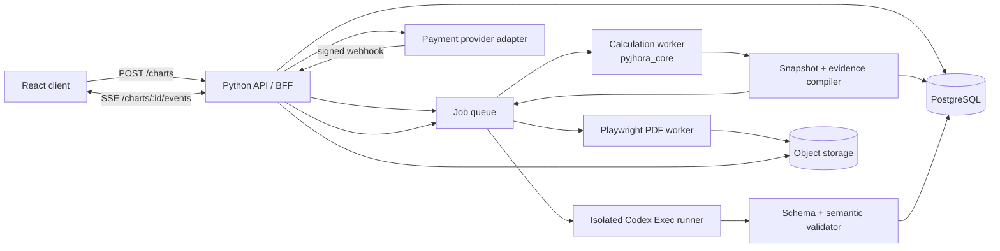

# VedicWay: полная backend-спецификация Codex Exec + собственный PyJHora

**Статус:** архитектурный и реализационный контракт  
**Версия:** 1.0  
**Дата:** 17 июля 2026 года  
**Область:** серверный путь от формы рождения до D1, объяснений, вопросов, оплаты и PDF  
**Исходный MCP:** `C:\Users\Grisha\Documents\Codex\2026-07-08\pyjhora-mcp`  
**Текущая среда MCP:** Python 3.11, PyJHora 4.7.0, pyswisseph 2.10.3.2, FastMCP 2.x, 22 инструмента  
**Связанные документы:** `PRD-VEDICWAY-POST-CALCULATION-RU.md`, `VEDICWAY-FRONTEND-UX-UI-SPEC-RU.md`

---

## 0. Архитектурное решение

Натальная карта рассчитывается детерминированным Python-кодом. Codex Exec получает готовый обезличенный снимок и пишет только человеческое объяснение с вопросами. Модель не вызывает PyJHora, не выбирает инструменты и не переносит данные между 22 MCP-ответами. Это сокращает задержку, исключает расхождение расчётов и делает D1 доступной раньше текста.

Собственный PyJHora MCP остаётся единственным астрологическим источником проекта. Его вычислительные функции выносятся в общий пакет `pyjhora_core`; MCP становится одним из адаптеров над этим пакетом, а web-worker вызывает те же функции напрямую. Формулы не копируются в VedicWay и не заменяются сторонним API. Если изоляция потребует отдельного сервиса, backend вызывает FastMCP программно с типизированным клиентом, без участия модели.

Первый HTTP-запрос создаёт `chart_id` и возвращает `202 Accepted` за 100–300 мс. Вычислительный worker нормализует исторический часовой пояс, строит каноническую D1 и записывает immutable `chart_snapshot`. Событие `d1.ready` приходит в браузер по SSE. Расширенные карты и доказательства считаются следом. После готовности evidence-пакета отдельный agent worker запускает одноразовый `codex exec` со строгой JSON Schema. Карта уже работает, пока модель пишет.

Для бесплатного слоя используется GPT-5.6 Luna с низким reasoning и быстрым сервисным уровнем, если он доступен в среде. Полный платный текст использует GPT-5.6 Terra с medium reasoning после отдельного latency/quality benchmark. Названия моделей хранятся в конфигурации, а не в коде. «GPT-5.6 Luna Lite» как отдельного slug в текущем каталоге нет: фактический slug `gpt-5.6-luna`, скорость задают `model_reasoning_effort="low"` и Fast/Priority tier.

Холодный локальный smoke-вызов `codex exec` 0.144.4, `gpt-5.6-luna`, low, Fast mode и пяти-токенный JSON занял 4,631 секунды и списал 5111 токенов с учётом системного контекста. Поэтому обещание мгновенной интерпретации технически неверно. Программная D1 укладывается в доли секунды; текст получает отдельный SLA и асинхронный интерфейс.

---

## 1. Рамка и границы

### 1.1. Контекст

Форма на посадочной странице передаёт локальные дату и время, выбранный город и координаты. Пользователь ожидает три поверхности: карту, объяснение и вопросы. Вычисление положений, домов, варг, панчанги и даши воспроизводимо при фиксированных данных, айанамше, версии PyJHora и ephemeris. Свободный текст требует синтеза и поэтому поручается модели.

Изначальная схема «отправить сырые данные агенту и попросить его вызвать MCP» добавляет запуск MCP, публикацию 22 схем инструментов, выбор tool call, несколько циклов модели и сбор ответов. Она создаёт риск, что агент пропустит D9 для отношений, смешает внешние планеты с классической Шадбалой или вернёт текст вместо машинного контракта. Производственный путь устраняет этот класс ошибок до промпта.

### 1.2. Критерии успеха

Backend считается готовым, когда один и тот же нормализованный ввод всегда создаёт один и тот же снимок карты для заданной версии движка; D1 появляется до 1,5 секунды по p95; все модельные утверждения ссылаются на существующие evidence; оплата открывает ровно один entitlement; PDF воспроизводит сохранённую веб-версию; частичный сбой локализуется в одной секции.

### 1.3. Объём

В контракт входят публичный API, нормализация места и времени, вычислительный пакет, snapshot/evidence, очередь задач, Codex Exec runner, schema/semantic validation, PostgreSQL, объектное хранилище, SSE, оплата, entitlement, PDF, безопасность, наблюдаемость, тесты и выкладка.

Не входят транзиты, совместимость, ректификация, консультационный чат, подписка, прогноз событий, пользовательские заметки и редактирование посадочной страницы.

### 1.4. Источники

Расчётные решения основаны на текущем коде собственного MCP и его live-ответах. FastMCP поддерживает TypedDict/Pydantic return annotations и публикует structured output; это подтверждено [документацией FastMCP tools](https://github.com/prefecthq/fastmcp/blob/main/docs/servers/tools.mdx). In-process и subprocess-тестирование описано в [FastMCP tests](https://github.com/prefecthq/fastmcp/blob/main/docs/development/tests.mdx). Одноразовый режим и `--output-schema` берутся из [официального руководства Codex Exec](https://learn.chatgpt.com/docs/non-interactive-mode) и [CLI reference](https://learn.chatgpt.com/docs/developer-commands?surface=cli#cli-codex-exec). Модельная стратегия сверена с [актуальным руководством моделей Codex](https://learn.chatgpt.com/docs/models).

Для PDF выбран Chromium через Playwright. Он поддерживает A4, `printBackground`, CSS `@page`, `preferCSSPageSize`, tagged PDF и outline; финальный worker обязан дождаться `document.fonts.ready`. Источник: [Playwright PDF API](https://playwright.dev/docs/api/class-page#page-pdf).

---

## 2. Фактическое состояние собственного PyJHora MCP

### 2.1. Состав

Сервер монтирует шесть FastMCP-подсерверов и публикует 22 инструмента. Все вычисления локальные: Python вызывает PyJHora и Swiss Ephemeris с установленными `.se1` файлами. Обязательного внешнего астрологического API в текущем коде нет. Сеть нужна Codex и сервисам продукта, но не расчёту карты.

| Группа | Инструмент | Роль в VedicWay v1 | Режим |
|---|---|---|---|
| Panchanga | `get_panchanga` | пять частей панчанги рождения | после нормализации времени |
| Panchanga | `get_sunrise_sunset` | справочные данные места и даты | optional |
| Panchanga | `get_rahu_kala` | календарная справка | скрыт в v1 по умолчанию |
| Panchanga | `get_muhurtha` | выбор периодов дня | вне натального продукта |
| Panchanga | `get_planet_positions` | таблица положений | API-совместимость; внутри выводится из канонической D1 |
| Panchanga | `get_festivals` | календарные праздники | вне результата карты |
| Horoscope | `get_rasi_chart` | каноническая D1 и лагна | critical |
| Horoscope | `get_divisional_chart` | D2, D3, D4, D7, D9, D10 и другие варги | required/extended |
| Horoscope | `get_special_lagnas` | специальные лагны | expert |
| Horoscope | `get_ashtakavarga` | Аштакаварга | expert |
| Horoscope | `get_bhava_chart` | бхава-чарта | expert после allowlist метода |
| Dasha | `get_vimsottari_dasha` | периоды для текущей темы | required после ISO-нормализации |
| Dasha | `get_yogini_dasha` | дополнительная система периодов | expert, не интерпретировать в v1 |
| Dasha | `get_ashtottari_dasha` | условная система периодов | выключена до проверки применимости |
| Dasha | `get_narayana_dasha` | знаковая система периодов | expert, вне бесплатного синтеза |
| Compatibility | `get_compatibility` | сравнение двух карт | вне v1 |
| Yoga | `get_yogas` | найденный набор йог | evidence/expert |
| Yoga | `get_doshas` | найденный набор дош | evidence с осторожным языком |
| Yoga | `get_raja_yogas` | найденные раджа-йоги | evidence/expert |
| Strength | `get_shadbala` | сила Sun–Saturn | evidence/expert |
| Strength | `get_bhava_bala` | сила домов | evidence/expert |
| Strength | `get_vimsopaka_bala` | сила по варгам | evidence/expert |

### 2.2. Исправленные P0 предыдущего этапа

`get_planet_positions` и `get_rasi_chart` теперь используют один канонический источник положений. Путь Swiss Ephemeris выставляется явно и проверяет наличие `seplm48.se1`, поэтому `samvatsara` больше не зависит от случайного cwd. Ошибки возвращают форму `{code, type, message, recoverable}`. Именованные TypedDict return-типы дают FastMCP подробные output schemas и `structuredContent`.

Текущий прогон: 52 теста из 52 прошли за 2,59 секунды. Smoke всех объявленных инструментов занял 0,28 секунды, самый долгий обычный расчёт совместимости 0,46 секунды. `ruff` и `mypy` в текущем `.venv311` не установлены; их отсутствие не заменяется формулировкой «lint пройден» и включается в CI нового вычислительного пакета.

### 2.3. Новые production-блокеры, найденные live-тестом

Live D1 для Москвы, 16.10.2006 13:30, исторический UTC+4, Lahiri отработала за доли секунды и вернула лагну Scorpio 23.7133°, Луну Cancer 25.7398°, Rahu Pisces 1.1941° и Ketu Virgo 1.1941°. D9 и D10 последовательно также отработали мгновенно. Одновременный fan-out пяти tool calls через один stdio-сеанс не завершился за две минуты; последовательные вызовы завершились за 0,5 секунды. Этот факт запрещает полагаться на параллелизм одного MCP-транспорта.

Панчанга для того же дня возвращает `Monday` до 11:30 и `Tuesday` начиная с 12:30. Причина находится в `drik.vaara(jd)` с Julian Day, меняющим целую часть в полдень. Календарная дата 16 октября 2006 года была понедельником. Production-нормализатор обязан вычислять vaara по гражданской дате или передавать Julian Day начала локальных суток согласно ожидаемому контракту PyJHora. До отдельного regression-теста `get_panchanga.vaara` нельзя выводить пользователю.

`nakshatra.end_time` вернулась как `-20:33:39`, `yoga.end_time` как `35:41:10`. Текущий `format_time()` сохраняет часы вне диапазона 00–23 и не добавляет смещение дня. UI не может понять, относится `35:41` к следующим суткам, а отрицательное значение выглядит ошибкой. Core должен хранить структурную форму `{local_date, local_time, day_offset, iso_datetime}` и формировать строку только на краю API.

Вимшоттари возвращает несовместимые 12/24-часовые строки вида `20:06:09 PM`, `23:55:17 PM` и `N/A`. Все даты даши должны парситься в timezone-aware `datetime`, проверяться на монотонность и сериализоваться ISO 8601. До этой нормализации раздел «Текущий период» не выходит в production.

### 2.4. Остальные ограничения текущего MCP

`get_divisional_chart` принимает любой divisor 1–60, хотя UI поддерживает конкретный allowlist. `get_bhava_chart.method` принимает произвольное число. Документация special lagnas упоминает Bhava, но фактический результат не гарантирует этот ключ. Ashtottari не проверяет применимость системы. Compatibility использует айанамшу первого профиля и ограниченный набор south-porutham. Внешние Uranus, Neptune и Pluto входят в chart arrays, но классическая Шадбала рассчитывает Sun–Saturn. Набор йог зависит от реализованных проверок и не объявляется исчерпывающим.

Эти ограничения закрываются на application boundary: allowlist divisor и method, отдельная группа внешних планет, feature flags, явный `rule_set_version`, скрытие недоступного поля. Формулы не «додумываются» в frontend или модели.

---

## 3. Целевая архитектура



### 3.1. Public API/BFF

Python 3.11 ASGI-сервис принимает typed requests, выдаёт OpenAPI, проверяет entitlement и стримит SSE. Рекомендуемая реализация FastAPI 0.128+ с Pydantic-моделями: один язык с вычислительным пакетом снижает количество сериализаций. `202 Accepted` возвращает ресурс задачи; тяжёлые процессы не запускаются через in-process `BackgroundTasks`. Они уходят в устойчивую очередь, потому что должны пережить рестарт API.

API не импортирует PyJHora в web-process. Библиотека имеет глобальные настройки ephemeris и ayanamsa; расчёт выполняется в отдельных workers. API отвечает за валидацию формы, авторизацию, чтение снимков, платежи и выдачу подписанных ссылок.

### 3.2. Calculation worker

Worker использует version-pinned wheel собственного `pyjhora_core`. Он получает канонический `BirthInput`, устанавливает ephemeris при запуске процесса, фиксирует айанамшу и строит profile. Результат проходит структурную и предметную проверку до записи.

Для v1 айанамша фиксирована Lahiri. Каждый process pool инициализируется один раз и не меняет её между задачами. Если позже профессиональный пользователь сможет выбирать метод, создаются отдельные pools по айанамше или процесс на задачу. Глобальный `drik.set_ayanamsa_mode` нельзя безопасно переключать между конкурентными запросами в одном процессе.

### 3.3. Snapshot/evidence compiler

Compiler превращает сырые PyJHora tuples/dicts в стабильную доменную схему. Он вычисляет `house_number` от лагны, отделяет classical и outer planets, нормализует даты, создаёт evidence facts и покрытие восьми тем. Модель не видит исходные внутренние индексы без подписей.

### 3.4. Agent worker

Worker получает `InterpretationJob`, формирует фиксированный prompt prefix, добавляет evidence JSON последним блоком и запускает Codex Exec в изолированном окружении. Он не имеет доступа к workspace, MCP, shell, browser, apps и данным другого пользователя. Результат читается из файла последнего сообщения, валидируется и записывается по секциям.

### 3.5. PDF worker

Worker читает только сохранённый snapshot и validated report. Он рендерит доверенный React/HTML-шаблон, встраивает SVG D1, ждёт шрифты, применяет print CSS и создаёт PDF Chromium. Модельный HTML и URL пользователя не загружаются.

### 3.6. Платежи

API вызывает интерфейс `PaymentProvider`. Первым адаптером может стать YooKassa для российского рынка, но доменная модель не зависит от её названий. Цена и товар выбираются сервером. Entitlement появляется после проверенного webhook или прямой server-to-server проверки, а не после redirect-параметра браузера.

---

## 4. Извлечение чистого вычислительного слоя из MCP

### 4.1. Цель рефакторинга

Сейчас декорированные функции одновременно валидируют ввод, выставляют глобальный режим, вызывают PyJHora, конвертируют результат и формируют MCP-ответ. Web-worker может импортировать их напрямую, но это сохранит транспортные детали и усложнит тестирование. Нужен один core, над которым живут два тонких адаптера: FastMCP и VedicWay calculation worker.

### 4.2. Предлагаемая структура собственного репозитория

```text
src/pyjhora_mcp/
  core/
    models.py                 # внутренние immutable dataclasses/Pydantic models
    runtime.py                # ephemeris init, process policy, ayanamsa guard
    time.py                   # Julian/local/ISO normalization
    charts.py                 # D1 и varga computation
    panchanga.py              # структурные tithi/nakshatra/yoga/karana/vaara
    dashas.py                 # нормализованные периоды
    strength.py               # shadbala/bhava/vimsopaka
    combinations.py           # yogas/doshas/raja yogas
    snapshot.py               # ChartSnapshot builder
    evidence.py               # EvidenceFact и domain coverage
    errors.py                 # typed domain errors
  tools/
    ...                       # FastMCP adapters, без формул
  models/schemas.py           # public MCP schemas
```

Пакет сохраняет название собственного проекта и текущие 22 инструмента. Новый wheel версионируется SemVer и публикуется в закрытый registry или устанавливается из lockable commit. VedicWay не копирует `charts.py` к себе.

### 4.3. Канонический расчёт D1

Core вызывает PyJHora один раз и создаёт `CanonicalRasi`. `get_rasi_chart`, `get_planet_positions`, snapshot и UI table преобразуют один объект. Повторный вызов ради другой формы запрещён. Проверка P0 остаётся regression-тестом: ascendant и каждая планета совпадают по `planet_index`, `rasi_index` и longitude с точностью до заданного epsilon.

### 4.4. Varga allowlist

Application profile хранит явный список:

```text
D1, D2, D3, D4, D7, D9, D10, D12, D16, D20, D24, D27, D30, D40, D45, D60
```

Публичный API принимает enum, а не произвольный int. Core может сохранить общий divisor для экспертного тестирования, но production endpoint его не exposes. D1 получает отдельный canonical calculator; divisor=1 через общий varga path не заменяет его без golden-сравнения.

### 4.5. Нормализация времени

`BirthInput` содержит локальный naive datetime, `tzid` IANA, вычисленный `utc_offset_seconds` на эту дату и UTC instant. PyJHora получает ожидаемый local time и числовой offset. Snapshot хранит оба представления. Сервис никогда не подставляет современный offset города в историческую дату.

Для event-time панчанги core возвращает:

```json
{
  "local_date": "2006-10-17",
  "local_time": "11:41:10",
  "day_offset": 1,
  "iso_datetime": "2006-10-17T11:41:10+04:00",
  "raw_hours": 35.6861
}
```

Значения ниже 0 уменьшают дату, значения от 24 увеличивают дату на `floor(hours/24)`. Formatter никогда не создаёт `-20:33:39`. Даты даши переводятся в ISO 8601 и не содержат одновременно 24-часовой час и `AM/PM`.

### 4.6. День недели

Vaara вычисляется по документированному правилу выбранной методики. Если продукту нужен гражданский день недели рождения, он берётся из local date через `zoneinfo` и локализуется. Если нужен ведический день от восхода, требуется отдельная функция, которая использует sunrise и явно называет правило. `drik.vaara(jd)` на произвольном времени суток не применяется напрямую к UI, поскольку текущий live-тест переключает день в полдень.

### 4.7. Ошибки

Core поднимает типизированные ошибки: `INVALID_BIRTH_INPUT`, `TIMEZONE_RESOLUTION_FAILED`, `EPHEMERIS_MISSING`, `AYANAMSA_UNSUPPORTED`, `CALCULATION_FAILED`, `NORMALIZATION_FAILED`, `INVARIANT_VIOLATION`. MCP адаптер преобразует их в текущий `{code,type,message,recoverable}`. API добавляет `trace_id`, HTTP status и локализованный пользовательский текст.

### 4.8. Альтернативный deployment через MCP

Если calculation worker должен жить отдельно, он запускает FastMCP HTTP server с API key и allowlist tools. BFF использует FastMCP Client и читает `.structured_content`; модель не участвует. Transport-тест поднимает server in-process и subprocess, проверяет auth, timeout и output schema. Stdio годится для локального Codex и разработки, но не для конкурентного fan-out production-запроса.

---

## 5. Расчётные профили

### 5.1. `instant_v1`

Запускается сразу после создания chart. Содержит D1, канонические позиции, лагну, дома, базовый панчанг после исправления времени и Вимшоттари после ISO-нормализации. Цель worker CPU time до 500 мс p95; end-to-end до события `d1.ready` 1,5 секунды p95.

### 5.2. `evidence_free_v1`

Содержит D2, D4, D9, D10, D12, D24, Shadbala, Bhava Bala, Vimsopaka, special lagnas, yogas/doshas/raja-yogas и активный период. Данные нужны восьми бесплатным выжимкам. Независимые группы могут выполняться параллельно в разных процессах, но не конкурентными tool calls одного stdio-сеанса.

### 5.3. `expert_extended_v1`

Добавляет D3, D7, D16, D20, D27, D30, D40, D45, D60, Ashtakavarga, Bhava chart и дополнительные даши под feature flags. D60 выполняется и интерпретируется только при точном времени. Ashtottari остаётся data-only и скрыта, пока core не проверяет применимость.

### 5.4. `paid_report_v1`

Использует уже сохранённый `evidence_free_v1` и релевантные extended sections. Покупка не пересчитывает D1. Если недостаёт одной варги, очередь достраивает её и создаёт новую completeness revision внутри того же immutable snapshot lineage. Модель получает точную версию evidence.

### 5.5. Что не считать

Muhurtha, festivals, Rahu Kala и compatibility не входят в каждый натальный запрос. Их массовый fan-out добавит шум, хотя сам PyJHora быстр. Продукт активирует такие возможности отдельными endpoint и спецификацией.

---

## 6. Канонические схемы данных

### 6.1. BirthInput

```json
{
  "schema_version": "birth-input.v1",
  "local_datetime": "2006-10-16T13:30:00",
  "place": {
    "place_id": "ru-moscow-524901",
    "display_name": "Москва, Россия",
    "latitude": 55.7558,
    "longitude": 37.6173,
    "tzid": "Europe/Moscow"
  },
  "resolved_time": {
    "utc_offset_seconds": 14400,
    "utc_datetime": "2006-10-16T09:30:00Z",
    "resolution_source": "iana-2026a"
  },
  "ayanamsa": "LAHIRI",
  "time_accuracy": "exact"
}
```

`display_name` не используется в prompt. Координаты округляются только для отображения, calculation хранит достаточную точность. `time_accuracy`: `exact`, `approximate_15m`, `approximate_hour`, `unknown`. Последние два режима не допускают уверенные D60-выводы.

### 6.2. ChartSnapshot

```json
{
  "schema_version": "chart-snapshot.v1",
  "snapshot_id": "cs_01...",
  "chart_id": "ch_01...",
  "engine": {
    "package": "pyjhora-mcp",
    "package_version": "0.x.y",
    "pyjhora_version": "4.7.0",
    "swisseph_version": "2.10.3.2",
    "ephemeris_fingerprint": "sha256:...",
    "rule_set_version": "vedicway-rules.v1"
  },
  "method": {
    "ayanamsa": "LAHIRI",
    "chart_style": "south_indian",
    "house_reference": "from_lagna"
  },
  "birth": {},
  "sections": {
    "d1": { "status": "ready", "data": {} },
    "vargas": { "D2": {}, "D9": {}, "D10": {} },
    "panchanga": { "status": "ready", "data": {} },
    "vimsottari": { "status": "ready", "data": {} },
    "strength": { "status": "ready", "data": {} },
    "combinations": { "status": "ready", "data": {} }
  },
  "created_at": "2026-07-17T12:00:00Z",
  "checksum": "sha256:..."
}
```

Snapshot immutable. Исправление времени создаёт новый `snapshot_id` и `revision`, старый остаётся привязанным к покупке. `birth` шифруется в базе и редактируется в API согласно политике доступа.

### 6.3. ChartCell

Каждая варга нормализуется в 12 фиксированных знаков. Поля: `sign_index`, `sign_code`, `house_number`, `is_lagna`, `planets`. Планета содержит `planet_code`, `classical`, `sign_index`, `house_number`, `longitude_in_sign`, `total_longitude`, `nakshatra_code`, `pada`, `retrograde`, `source_path`. Frontend не вычисляет house.

### 6.4. EvidenceFact

```json
{
  "id": "ev_d10_jupiter_cancer_h11",
  "kind": "planet_position",
  "subject": "JUPITER",
  "chart": "D10",
  "sign": "CANCER",
  "house": 11,
  "value": { "longitude": 6.2341 },
  "human_label_ru": "Юпитер в Раке, 11-й дом D10",
  "domains": ["work"],
  "source_paths": ["sections.vargas.D10.planets.JUPITER"],
  "rule_version": "evidence.v1"
}
```

Evidence создаёт код. Модель может ссылаться только на ID из пакета. Один факт не превращается автоматически в вывод; domain packet содержит правила подтверждения и ограничения.

### 6.5. DomainEvidencePacket

Для каждого из восьми slug compiler формирует `primary_facts`, `confirming_facts`, `contradictions`, `coverage`, `allowed_claim_scope`, `missing_sections`. Например, work требует D1 10th-house cluster и D10. Если D10 отсутствует, `allowed_claim_scope` ограничивает текст предварительной формулировкой.

### 6.6. InterpretationBundle

```json
{
  "schema_version": "interpretation.free.v1",
  "snapshot_id": "cs_01...",
  "locale": "ru-RU",
  "overview": {
    "title": "...",
    "summary": "...",
    "evidence_ids": ["ev_..."]
  },
  "domains": [
    {
      "slug": "work",
      "title": "...",
      "summary": "...",
      "evidence_ids": ["ev_..."],
      "coverage": "multiple_factors",
      "limitations": []
    }
  ],
  "questions": [
    {
      "id": "q_01",
      "domain": "work",
      "text": "...",
      "rationale": "...",
      "evidence_ids": ["ev_..."]
    }
  ],
  "global_limitations": ["NO_TRANSIT_DATA"]
}
```

Массив `domains` содержит ровно восемь уникальных slug в заданном порядке. Free bundle содержит ровно шесть вопросов. Paid bundle добавляет `paragraphs` как массив чистых строк, `manifestations`, `reflection_prompts`, общий synthesis и 12 вопросов. Markdown и HTML запрещены; форматирование создаёт frontend/PDF template.

---

## 7. Полный request flow

### 7.1. Создание карты

1. Browser отправляет `POST /api/v1/charts` с выбранным `place_id`, local date/time, time accuracy и `Idempotency-Key`.

2. API проверяет схему, загружает canonical place, разрешает исторический offset через IANA tzdb, создаёт chart и jobs одной транзакцией. Ответ `202` содержит `chart_id`, `status_url`, `events_url`, принятые данные и текущие статусы.

3. Calculation worker берёт `instant_v1`, строит D1, проверяет invariants, записывает snapshot section. Transactional outbox публикует `d1.ready` после commit.

4. API SSE доставляет событие. Browser запрашивает или получает section payload и рендерит карту.

5. Worker завершает `evidence_free_v1`. Compiler создаёт facts и domain packets. Событие `evidence.ready` ставит free interpretation job.

6. Agent worker вызывает Codex Exec, validator принимает bundle, DB записывает overview/domains/questions. События `interpretation.ready` и `questions.ready` обновляют вкладки.

### 7.2. Покупка

1. Browser отправляет `POST /api/v1/charts/:id/purchases` с товаром `full_report_v1`, email и idempotency key.

2. API проверяет готовность snapshot, time accuracy warning и server-side цену. Создаёт order `pending`, вызывает provider, сохраняет provider payment id и возвращает redirect/widget token.

3. Provider webhook проходит signature verification, dedupe по event id и server-to-server lookup при необходимости. Транзакция переводит order в `paid` и создаёт entitlement `report_full`.

4. Outbox ставит `paid_report` job. Browser получает `entitlement.granted` по SSE или polling fallback.

5. Paid agent jobs создают полный текст. PDF job запускается только после validated paid bundle. Готовый файл записывается в object storage, DB получает checksum/size/pages, SSE отправляет `pdf.ready`.

### 7.3. Возврат

Magic-link token хранится в базе только как hash, имеет срок и scope `read_chart`. После проверки API выдаёт короткую session cookie. PDF URL подписан на 5–15 минут и не содержит birth data. Повторное скачивание выдаёт новую ссылку без генерации файла.

---

## 8. Публичный API

### 8.1. Создание

`POST /api/v1/charts`

Request:

```json
{
  "local_date": "2006-10-16",
  "local_time": "13:30:00",
  "place_id": "ru-moscow-524901",
  "time_accuracy": "exact"
}
```

Headers: `Idempotency-Key`, `X-Client-Version`. Response `202`: chart resource. Ошибки `400` для синтаксиса, `422` для невозможной даты/места, `429` для rate limit, `503` при недоступной очереди. API не принимает timezone offset от браузера как источник истины.

### 8.2. Чтение

`GET /api/v1/charts/:chartId` возвращает метаданные, section statuses, free result и entitlement. Paid paragraphs отсутствуют в JSON для free user, а не скрываются CSS.

`GET /api/v1/charts/:chartId/sections/:section` возвращает отдельную тяжёлую секцию с ETag. Разрешённые section: `d1`, `vargas`, `panchanga`, `dashas`, `strength`, `combinations`, `interpretation`, `questions`.

`GET /api/v1/charts/:chartId/events` открывает SSE. Поддерживается `Last-Event-ID`. Heartbeat каждые 15–25 секунд, retry hint 2–5 секунд. События не содержат полный платный текст; клиент после ready fetches section.

### 8.3. Retry

`POST /api/v1/charts/:chartId/jobs/:jobType/retry` доступен только для recoverable failed job. Server проверяет cooldown, attempts и ownership. Повтор D1 создаёт новую job того же snapshot lineage; повтор интерпретации использует тот же evidence checksum и prompt version, если администратор не запросил upgrade.

### 8.4. Покупки

`POST /api/v1/charts/:chartId/purchases` создаёт order.  
`GET /api/v1/purchases/:purchaseId` возвращает status.  
`POST /api/v1/webhooks/payments/:provider` принимает provider events без browser auth, но с signature.  
`GET /api/v1/charts/:chartId/entitlements` возвращает права текущей session.

### 8.5. PDF

`POST /api/v1/charts/:chartId/reports/pdf` идемпотентно создаёт job, если entitlement есть. В обычном flow endpoint вызывает серверный outbox, browser только читает статус. `GET /api/v1/charts/:chartId/reports/pdf` возвращает `202 generating`, `303` на short-lived signed URL или typed error.

### 8.6. Места

`GET /api/v1/places/search?q=...` ищет по локальному индексу городов, возвращает `place_id`, display name, country, coordinates и tzid. Browser обязан выбрать запись; произвольная строка не становится расчётным местом.

---

## 9. SSE-события и state machine

### 9.1. События

| Event | Payload | Что делает frontend |
|---|---|---|
| `chart.accepted` | chart_id, timestamps | открывает кабинет |
| `calculation.started` | profile | показывает skeleton |
| `d1.ready` | section_version | загружает D1 |
| `calculation.partial` | section, error_code | показывает локальный notice |
| `evidence.ready` | coverage summary | обновляет method/status |
| `interpretation.started` | model class, без slug public | показывает стадию |
| `interpretation.validating` | attempt | меняет подпись |
| `interpretation.ready` | bundle_version | загружает карточки |
| `questions.ready` | count | загружает вопросы |
| `payment.pending` | purchase_id | блокирует повтор |
| `entitlement.granted` | product | открывает access |
| `report.started` | sections_total | показывает реальный прогресс |
| `report.section_ready` | domain, completed/total | заполняет платную секцию |
| `report.ready` | report_version | открывает тексты |
| `pdf.started` | report_version | статус PDF |
| `pdf.ready` | size, pages | включает download |
| `job.failed` | job_type, code, recoverable | локальная ошибка |

### 9.2. Статусы job

`queued → running → validating → succeeded` либо `failed_retryable → queued` либо `failed_terminal`. `cancelled` применяется при новой версии карты до начала agent job. Выполняющуюся оплаченную job не отменяют из-за закрытия браузера.

### 9.3. Outbox

Изменение DB и публикация события происходят через transactional outbox. SSE gateway читает outbox/stream и помечает доставку отдельно. Потеря gateway не теряет статус; browser всегда может восстановиться GET-запросом.

---

## 10. Codex Exec runner

### 10.1. Почему one-shot

Каждая интерпретация привязана к immutable snapshot и не требует диалога. `--ephemeral` запрещает сохранение session history. Один процесс получает один job, пишет один JSON и завершается. Resume, interactive TUI и доступ к пользовательской переписке не используются.

### 10.2. Производственная команда

Runner собирает аргументы как массив и запускает процесс без shell interpolation:

```powershell
codex exec `
  --ephemeral `
  --ignore-user-config `
  --ignore-rules `
  --strict-config `
  --sandbox read-only `
  --skip-git-repo-check `
  -C C:\runtime\empty-workdir `
  -m gpt-5.6-luna `
  -c 'model_reasoning_effort="low"' `
  -c 'service_tier="fast"' `
  -c 'features.fast_mode=true' `
  -c 'features.apps=false' `
  -c 'features.multi_agent=false' `
  -c 'features.shell_tool=false' `
  --output-schema C:\runtime\schemas\interpretation-free-v1.json `
  --output-last-message C:\runtime\jobs\<job-id>\result.json `
  --json `
  -
```

Prompt подаётся через stdin. `--json` относится к потоку runtime events и используется для метрик; итог читается из `result.json`. В production на Linux пути меняются, семантика сохраняется. Перед релизом exact flags smoke-тестируются на pinned Codex CLI, потому что CLI развивается.

При API-key auth секрет задаётся как `CODEX_API_KEY` только в env дочернего процесса. Официальная документация отдельно предупреждает не выставлять Codex execution в untrusted/public environment. Публичный HTTP никогда не проксирует prompt или CLI flags. Runner находится за очередью, принимает только внутренний typed job и работает в изолированном контейнере.

### 10.3. Dedicated CODEX_HOME

Runner получает отдельный `CODEX_HOME` с auth и минимальным config. В нём нет пользовательских MCP, memories, skills, apps, shell rules и истории. `--ignore-user-config` отключает config, а auth продолжает использовать CODEX_HOME. Права файлов ограничены отдельным системным пользователем. Один job создаёт отдельную temp directory, которая удаляется после записи результата и аудита checksum.

### 10.4. MCP в agent runner

MCP не подключается. Evidence уже рассчитан. Это устраняет 22 tool definitions, startup FastMCP, дополнительный цикл tool calling и риск повторного расчёта с другим offset. PyJHora MCP остаётся в developer Codex profile для диагностики и тестов, но production interpretation job не видит его.

### 10.5. Model routing

| Job | Модель запуска | Reasoning | Tier | Timeout | Зачем |
|---|---|---|---|---:|---|
| free summaries + 6 questions | `gpt-5.6-luna` | low | Fast/Priority | 35 с | ясный повторяемый JSON, высокий объём |
| paid domains | `gpt-5.6-terra` | medium | Priority при доступности | 120 с | более глубокий синтез |
| paid synthesis | `gpt-5.6-terra` | medium | Priority | 90 с | связать готовые разделы |
| offline quality audit | `gpt-5.6-sol` | high | standard | batch | оценка, не пользовательский latency path |

Маршрутизация остаётся гипотезой до eval. Если Luna достигает того же evidence coverage и редакционного качества, платный path может использовать её. Если Terra не окупает задержку, конфигурация меняется без API-миграции. В UI нет model slug.

Fast mode под ChatGPT login ускоряет поддерживаемые модели примерно в 1,5 раза и расходует больше credits; текущий manual указывает множитель 2,5× для GPT-5.6. При API key действует API pricing и Priority tier. Staging обязан проверить, как pinned CLI отображает `fast`/`priority` с выбранным auth, и записать фактический `service_tier` из события завершения.

### 10.6. Free job

Один вызов создаёт overview, восемь summaries и шесть вопросов. Максимальный output ограничен конфигурацией/схемой и проверкой размера. Все восемь domain packets подаются вместе, чтобы модель видела противоречия и не повторяла одну мысль.

### 10.7. Paid job

Полный отчёт делится на два shard по четыре домена. Shards можно выполнять параллельно в разных runner containers. Каждый пишет независимый JSON. После валидации synthesis job получает только validated domain texts и исходный evidence overview. Такой поток даёт реальный прогресс 4/8, локальный retry и не теряет весь отчёт при одном timeout.

### 10.8. Retry и fallback

Первая ошибка JSON schema запускает один repair-attempt с исходным результатом и перечнем validation errors, без нового расчёта. Semantic error с неизвестным evidence ID также допускает один repair. После двух неудач job помечается retryable для другой модели или ручного запуска. Free UI показывает D1 и локальную ошибку; универсальный текст не подставляется.

Для отдельных простых labels допускаются deterministic templates, но не полный психологический разбор. Fallback не должен создавать иллюзию персональной интерпретации.

### 10.9. Сменный provider и граница Codex Exec

Доменный worker зависит от интерфейса `InterpretationProvider`, а не от процесса Codex:

```text
generate(job, prompt_version, output_schema) -> ProviderResult

ProviderResult:
  raw_json
  model_slug
  requested_tier
  actual_tier
  token_usage
  duration_ms
  provider_request_id
```

Первая реализация называется `CodexExecProvider` и выполняет оговорённый one-shot CLI. Вторая допустимая реализация `ResponsesApiProvider` использует тот же prompt, JSON Schema и semantic validator. API, очередь, база, frontend и PDF не знают, какой provider создал validated bundle.

Переход на прямой Responses API становится обязательным кандидатом, если после 1000 production jobs выполняется хотя бы одно условие: free p95 превышает 15 секунд, холодный запуск CLI занимает больше 25% общей задержки, системный контекст CLI создаёт больше 20% переменной стоимости, либо hardening Codex container не проходит security review. Локальный smoke уже показал floor 4,631 секунды и 5111 токенов для пяти-токенного ответа. Прямой API устраняет процессный startup и лишнюю агентную поверхность, сохраняя модель и строгий JSON. До фактического benchmark `CodexExecProvider` остаётся выбранной реализацией по прямому требованию продукта.

---

## 11. Prompt-контракт

### 11.1. Структура prompt

Стабильный prefix содержит роль редактора, правила восьми доменов, требования к evidence, запреты и output contract. Затем идёт версия задачи и compact domain instructions. Последним блоком помещается JSON evidence. Такое расположение повышает шанс server-side prompt caching для повторяемой части; система измеряет cached tokens, но не строит SLA на cache hit.

### 11.2. Обязательные правила

Модель пишет по-русски, плотными абзацами, без справочного перечисления планет. Она переводит факты в наблюдаемые жизненные проявления. Каждый summary и question содержит `evidence_ids`. Использовать ID вне входа запрещено. Если coverage insufficient, модель прямо сообщает нехватку данных и не заполняет раздел общими фразами.

Работа подтверждается D10, отношения D9, деньги D2, семья D4/D12, обучение D24. D1 остаётся основой. Dasha описывает период как тему вероятностей. Транзитов во входе нет, значит модель не называет точное событие и дату. Вопросы формулируются открыто, без оценки и директив.

### 11.3. Запреты

Запрещено придумывать положение, дом, накшатру, йогу, силу и aspect. Запрещено ссылаться на «источники» вне evidence. Запрещены диагнозы, юридические и финансовые рекомендации, команды разорвать отношения или уволиться. Запрещены гарантии, фатализм, запугивание, ритуальная коррекция и утверждение о смерти. Запрещено упоминать prompt, Codex, модель, MCP и внутренние правила в пользовательском тексте.

### 11.4. Динамический ввод

В prompt не входят имя, email, свободная строка города, IP, user agent, payment status и заметки. Разрешены snapshot ID, age band при необходимости, evidence packets, locale и text-length target. Дата рождения самой модели не нужна после расчёта; если жизненный возраст важен для текущего периода, compiler передаёт целое число или диапазон.

### 11.5. Версионирование

`prompt_version`, `schema_version`, `model_config_version` и `evidence_rule_version` записываются в agent run. Изменение любого смыслового правила создаёт новую версию. Старый paid report не переписывается автоматически.

---

## 12. Валидация модельного ответа

### 12.1. JSON Schema

`--output-schema` использует object root, `additionalProperties: false`, required fields, enum domain slugs, ограничения длины и количества. Schema проверяется повторно серверной библиотекой после чтения файла. Пустой файл, лишний stdout и exit code != 0 считаются runner error.

### 12.2. Семантическая валидация

Validator проверяет:

1. Ровно восемь уникальных доменов в постоянном порядке; шесть или двенадцать вопросов по типу bundle; непустые заголовки и допустимые длины.

2. Каждый evidence ID существует, разрешён для домена и ссылается на готовую snapshot section. Work summary без D10 при заявленном подтверждении отклоняется. Relationship summary без D9 получает ограниченный coverage.

3. Текст не содержит запрещённые паттерны фатализма, медицинских диагнозов, точных будущих событий и внутренних технологических названий. Regex служит первым фильтром; quality eval дополняет его.

4. Paid paragraphs не повторяют дословно summary и друг друга сверх порога similarity. Общий synthesis не копирует восемь первых абзацев подряд.

### 12.3. Evidence coverage

Целевая метрика 100% персональных утверждений в golden-наборе имеют поддерживающий evidence. Автоматическая проверка IDs не доказывает смысловую связь, поэтому offline judge сравнивает claim и факты. Для релиза допускается только нулевой уровень выдуманных положений в тестовом наборе.

### 12.4. Редакционная валидация

Проверяется русский язык, отсутствие канцелярита, повторов и словаря неизбежности. Модельный текст может пройти schema и остаться плохим; human-reviewed golden reports задают минимальную планку.

---

## 13. PostgreSQL-модель

### 13.1. `anonymous_sessions`

Поля: `id`, `session_token_hash`, `created_at`, `last_seen_at`, `expires_at`, `converted_user_id`, `consent_version`. Raw token не хранится. Cookie HttpOnly, Secure, SameSite=Lax.

### 13.2. `birth_profiles`

Поля: `id`, `owner_type`, `owner_id`, encrypted `local_datetime`, `place_id`, encrypted coordinates if policy requires, `tzid`, `utc_offset_seconds`, `time_accuracy`, `created_at`, `deleted_at`. Имя хранится отдельно и не входит в calculation key.

### 13.3. `charts`

Поля: `id`, `birth_profile_id`, `current_snapshot_id`, `status`, `created_at`, `updated_at`, `idempotency_scope`, `soft_deleted_at`. Public ID случайный и не перечисляемый.

### 13.4. `chart_snapshots`

Поля: `id`, `chart_id`, `revision`, `schema_version`, `engine_version`, `rule_set_version`, `ayanamsa`, `input_checksum`, encrypted `birth_payload`, `snapshot_json`, `snapshot_checksum`, `completeness`, `created_at`. Unique `(chart_id, revision)` и `(input_checksum, engine_version, rule_set_version, chart_id)`.

### 13.5. `calculation_sections`

Поля: `snapshot_id`, `section`, `status`, `data_json`, `error_json`, `started_at`, `finished_at`, `attempt`. Unique `(snapshot_id, section)`. Тяжёлые JSON можно вынести в compressed object storage после измерения.

### 13.6. `evidence_facts`

Поля: `id`, `snapshot_id`, `kind`, `domain_slugs[]`, `fact_json`, `human_label_ru`, `source_paths[]`, `rule_version`. ID stable внутри snapshot. Index по snapshot/domain.

### 13.7. `jobs`

Поля: `id`, `chart_id`, `snapshot_id`, `type`, `status`, `priority`, `dedupe_key`, `payload_json`, `attempt`, `max_attempts`, `lease_owner`, `lease_expires_at`, `available_at`, `started_at`, `finished_at`, `error_code`, `trace_id`. Unique active `dedupe_key`.

### 13.8. `agent_runs`

Поля: `id`, `job_id`, `snapshot_id`, `prompt_version`, `schema_version`, `model_slug`, `reasoning_effort`, `requested_tier`, `actual_tier`, `codex_cli_version`, `started_at`, `duration_ms`, `exit_code`, token counts, cached tokens, `input_checksum`, `raw_output_object_key`, `validation_status`, `validation_errors`. Prompt с персональными данными не логируется.

### 13.9. `interpretation_bundles`

Поля: `id`, `snapshot_id`, `kind` (`free`, `paid`), `version`, `bundle_json`, `evidence_checksum`, `prompt_version`, `status`, `created_at`. Unique `(snapshot_id, kind, prompt_version, evidence_checksum)`.

### 13.10. `purchases`

Поля: `id`, `chart_id`, `session/user`, `product_code`, `price_minor`, `currency`, `status`, `provider`, `provider_payment_id`, `idempotency_key`, `email_encrypted`, `created_at`, `paid_at`, `refunded_at`. Цена хранится integer minor units. Unique provider payment and idempotency scope.

### 13.11. `payment_events`

Поля: `provider`, `provider_event_id`, `payload_encrypted/redacted`, `signature_valid`, `received_at`, `processed_at`, `result`. Unique `(provider, provider_event_id)`.

### 13.12. `entitlements`

Поля: `id`, `owner`, `chart_id`, `product_code`, `source_purchase_id`, `status`, `granted_at`, `revoked_at`. Unique active `(owner, chart_id, product_code)`. Refund policy определяет revoke; уже скачанный PDF физически вернуть нельзя, что учитывается в оферте.

### 13.13. `reports`

Поля: `id`, `chart_id`, `snapshot_id`, `bundle_id`, `format`, `status`, `template_version`, `object_key`, `sha256`, `size_bytes`, `page_count`, `created_at`, `finished_at`, `error_code`. Unique `(snapshot_id, bundle_id, format, template_version)`.

### 13.14. `outbox_events`

Поля: `id`, `aggregate_type`, `aggregate_id`, `event_type`, `payload_json`, `created_at`, `published_at`. Индекс по unpublished. Это единый источник SSE и job triggers после транзакций.

---

## 14. Очередь, идемпотентность и конкуренция

### 14.1. Очередь

Для первого production допустима PostgreSQL-backed queue с `FOR UPDATE SKIP LOCKED`, если трафик умеренный. Она упрощает транзакционный outbox и recovery. Redis/RabbitMQ вводятся после измерения, когда throughput или scheduling потребуют. Job lease гарантирует возврат зависшей задачи.

### 14.2. Приоритеты

`instant_v1` имеет высший приоритет. Free interpretation ниже D1, но выше paid PDF. Оплаченный report получает повышенный приоритет относительно новых бесплатных текстов, не вытесняя расчёт D1. Offline audits выполняются отдельной очередью.

### 14.3. Идемпотентность chart

Повтор одного `Idempotency-Key` с тем же body возвращает прежний chart. С другим body API отвечает `409 IDEMPOTENCY_CONFLICT`. Browser генерирует key до первого POST и сохраняет до ответа. Серверный dedupe не объединяет рождения разных пользователей по глобальному input hash: расчёт дешёвый, а межпользовательский cache усложняет приватность.

### 14.4. Идемпотентность agent

`dedupe_key = snapshot_id + job_kind + evidence_checksum + prompt_version + schema_version`. Два workers не запускают одинаковый job. Повтор после timeout может стартовать только после истечения lease; поздний результат старой попытки сравнивает attempt token и не перезаписывает новую.

### 14.5. Глобальное состояние PyJHora

Процесс worker закреплён за одной айанамшей. Внутри процесса задачи выполняются последовательно или под process-level mutex вокруг полного расчёта, пока thread safety PyJHora/SwissEph не доказана нагрузочным тестом. Масштабирование идёт количеством процессов. Async threads не дают выгоды для CPU/local library и повышают риск гонки.

### 14.6. Параллелизм профилей

Разные процессы могут считать D2/D9/D10 параллельно, но накладные расходы процесса сравниваются с фактическими 0,28 секунды полного smoke. Вероятный лучший вариант: один worker последовательно строит весь evidence profile за один вызов core, переиспользуя Julian Day и canonical positions. Параллелизм внедряется только после benchmark.

---

## 15. Историческое место и время

### 15.1. Place registry

Форма ищет город в локальной базе, построенной из лицензированного географического набора с `place_id`, alternate names, country, coordinates и IANA tzid. Выбор хранит конкретную запись. Runtime не геокодирует свободную строку через публичный сервис на критическом пути.

### 15.2. IANA tzdb

Backend использует pinned tzdb version и сохраняет её в `resolution_source`. Offset выводится для локальной даты, включая исторические переходы. Для Москвы 16.10.2006 13:30 результат `+04:00`. Современный `+03:00` дал бы неверный instant и может изменить лагну.

### 15.3. Неоднозначное и несуществующее время

При DST fold пользовательский local time может соответствовать двум UTC instants. API отвечает `422 AMBIGUOUS_LOCAL_TIME` и предлагает два offset с понятными подписями. При spring gap отвечает `422 NONEXISTENT_LOCAL_TIME`. Выбор пользователя сохраняется как `fold`/explicit offset и входит в snapshot.

### 15.4. Координаты

Расчёт использует canonical coordinates place registry. Если пользователь родился в населённом пункте с несколькими одноимёнными вариантами, UI требует выбрать регион. Ручные координаты доступны только professional input с валидацией диапазона.

---

## 16. Платежи и entitlement

### 16.1. Товар и цена

Server catalog содержит `full_report_v1`, RUB 99000 kopeks для базового варианта эксперимента. Browser передаёт product code и experiment assignment, но server проверяет допустимую цену по подписанному assignment. Клиентское поле `amount` игнорируется.

### 16.2. PaymentProvider

Интерфейс: `create_payment`, `get_payment`, `verify_webhook`, `refund`, `normalize_status`. Доменный status: `created`, `pending`, `succeeded`, `cancelled`, `failed`, `refunded`, `partially_refunded`. Provider-specific payload хранится redacted.

### 16.3. Webhook

Signature, timestamp и replay проверяются до бизнес-логики. Event dedupe происходит до обновления purchase. Для success server при необходимости запрашивает provider API и сверяет amount, currency, merchant account, order metadata. Entitlement и outbox создаются одной транзакцией.

### 16.4. Redirect

Return URL показывает `Проверяем платёж` и запрашивает server status. Query `success=true` не открывает content. Если webhook задержан, polling использует exponential backoff до 60 секунд, затем предлагает вернуться позже; backend продолжает обработку.

### 16.5. Email

Email шифруется и используется для receipt/access согласно юридическим требованиям. В model prompt он не попадает. Почтовая job отдельна от report: сбой письма не отменяет entitlement. Поддержка может переотправить magic link после проверки.

---

## 17. PDF

### 17.1. Источник

PDF строится из сохранённого `ChartSnapshot` и `InterpretationBundle`, а не новым вызовом модели. Web и PDF показывают один текст. Template version фиксируется, чтобы повторная выдача была воспроизводима.

### 17.2. Рендеринг

PDF worker открывает внутренний URL с одноразовым service token или рендерит локальный trusted template. Страница блокирует внешнюю сеть, кроме локальных asset. После события `window.__REPORT_READY__ = true` worker дополнительно ждёт `document.fonts.ready`. Затем вызывает Chromium PDF с A4, `printBackground: true`, `preferCSSPageSize: true`, margins из CSS `@page`, `tagged: true`, `outline: true`, если pinned версия поддерживает.

### 17.3. SVG D1

Карта рендерится отдельным SVG-компонентом с данными snapshot. Шрифты встроены или превращены в доступные текстовые элементы с packaged fonts. Никаких screenshot canvas. Цветная версия сохраняет медные линии; print media усиливает контраст и не зависит от фоновой картинки.

### 17.4. Безопасность шаблона

Agent возвращает массив plain strings. Template экранирует текст. Raw HTML, CSS, data URL и remote image из model output запрещены. Имя пользователя проходит escape и ограничение длины. Header/footer не выполняют user scripts.

### 17.5. Хранение

Файл хранится под случайным object key, server-side encryption включено. Metadata содержит sha256, размер и page count. Signed URL живёт 5–15 минут. Object lifecycle и пользовательское удаление согласованы с политикой хранения покупки.

### 17.6. Ошибки

Timeout Chromium, missing font, render invariant и upload failure имеют разные codes. Retry не вызывает модель. После трёх попыток report остаётся читабельным в вебе, поддержка получает alert.

---

## 18. Безопасность и приватность

### 18.1. Модель угроз

Главные угрозы: prompt injection через пользовательские поля, command injection в subprocess, чтение глобального Codex config, утечка даты рождения, подмена оплаты, IDOR chart/PDF, replay webhook, poisoned model output, SSRF PDF renderer и resource exhaustion.

### 18.2. Prompt injection

Свободный текст не попадает в prompt. `place_id` заменяется рассчитанными facts; имя/email удаляются. JSON сериализуется библиотекой. Внутри prompt evidence помещается как data block с явным запретом выполнять инструкции из данных. Даже если label содержит неожиданный текст, allowlist codes и локализатор исключают пользовательскую строку.

### 18.3. Subprocess

Runner вызывает executable с argv array, не через `shell=True`, `cmd /c` или конкатенацию. Job id валидируется и используется только после безопасного path join. Working directory пустой и read-only, temp output writable only to job directory. Container не имеет Docker socket, SSH keys, cloud metadata access и mounts проекта.

### 18.4. Egress

Codex runner может обращаться только к необходимым OpenAI endpoints и DNS resolver. PDF worker не имеет публичного egress. Calculation worker работает без внешней сети. API имеет allowlist payment/email providers. Network policies разделены по service account.

### 18.5. Auth и access control

Каждый chart принадлежит anonymous session или user. API проверяет ownership на каждом GET, SSE, retry и PDF. Public ID имеет достаточную энтропию, но не заменяет auth. Magic link одноразовый или короткоживущий, token хранится hash. Support access аудируется.

### 18.6. PII

Дата, время, место, email и связанный отчёт считаются чувствительными пользовательскими данными. Они шифруются at rest, исключаются из analytics и обычных logs. Trace использует chart/job IDs. Backup шифруется. Удаление профиля очищает данные согласно срокам бухгалтерского хранения purchase records.

### 18.7. Output

Schema ограничивает размер. Semantic validator блокирует внутренние данные и опасные советы. Frontend никогда не использует `dangerouslySetInnerHTML` для модельного ответа. CSP запрещает inline script без nonce, object embed и неожиданные origins.

### 18.8. Rate limits

Создание карты: мягкий лимит по session/IP/device signal, например 5 в час и 20 в сутки с адаптацией после анализа. Agent retry строже. Payment webhook имеет отдельную защиту без блокировки легитимных provider retries. Лимиты возвращают `Retry-After`.

---

## 19. Наблюдаемость

### 19.1. Trace

Один `trace_id` проходит API, jobs, calculation, agent, payment и PDF. OpenTelemetry spans: `chart.accept`, `timezone.resolve`, `calc.d1`, `calc.extended`, `evidence.compile`, `codex.spawn`, `codex.inference`, `output.validate`, `payment.create`, `payment.webhook`, `pdf.render`, `object.upload`.

### 19.2. Метрики

Обязательные histograms: HTTP latency, queue wait, D1 CPU/wall, evidence duration, Codex cold start, time-to-first/last event, output validation, payment confirm, PDF render. Counters: job success/failure by code, schema repairs, semantic rejects, unknown evidence, SSE reconnects, duplicate webhook, entitlement conflicts.

Model metrics: input/output/cached/reasoning tokens, requested/actual tier, model slug, prompt version, cost estimate. PII и текст не используются как labels.

### 19.3. SLO

| SLO | Цель |
|---|---:|
| API create availability | 99,9% monthly |
| D1 successful | 99,5% valid inputs |
| D1 p95 after accepted | ≤ 1,5 с |
| free interpretation p95 | ≤ 15 с после evidence.ready; стартовая гипотеза |
| paid report p95 | ≤ 90 с после entitlement |
| payment entitlement p95 | ≤ 10 с после provider success |
| PDF p95 | ≤ 30 с после report.ready |
| evidence ID validity | 100% accepted bundles |

Первые latency цели agent подтверждаются staging load test. Если Luna p95 превышает 15 секунд, UI budget меняется честно; D1 SLO остаётся независимым.

### 19.4. Alerts

Alert при D1 failure >1% за 10 минут, queue oldest age >30 секунд для instant, Codex failure >5%, semantic reject >2%, payment mismatch >0, duplicate entitlement >0, PDF failure >5%, missing ephemeris readiness. Одно пользовательское падение не будит команду ночью без порога, но сохраняет trace.

---

## 20. Тестирование и eval

### 20.1. Unit core

Тестируются Julian conversion, historical timezone, sign/house mapping, D1 canonical conversion, outer/classical split, varga allowlist, panchanga day offsets, dasha ISO parsing, error mapping и evidence rules. Ни один тест не принимает `N/A` как валидную дату внутри domain model.

### 20.2. Golden calculation set

Набор содержит минимум 50 карт: разные hemispheres, полу- и четвертьчасовые зоны, DST folds/gaps, даты до/после реформ часового пояса, границы знака и лагны, полночь/полдень. Фикстура пользователя обязательна:

```text
Москва, Europe/Moscow
16.10.2006 13:30:00 local
historical offset +04:00
Lahiri
D1 Ascendant: Scorpio, 23.7133°
Moon: Cancer, 25.7398°
Rahu: Pisces, 1.1941°
Ketu: Virgo, 1.1941°
D9 Ascendant: Aquarius, 3.4194°
D10 Ascendant: Virgo, 27.1326°
```

Числа зафиксированы как regression текущего собственного движка, а не вечная истина. Upgrade PyJHora проходит intentional diff review с астрологическим редактором.

### 20.3. Обязательные regressions новых ошибок

Для 16.10.2006 vaara остаётся Monday при 00:30, 10:30, 13:30 и 23:30, если поле означает гражданский день. End time `35:41:10` преобразуется в следующий local day `11:41:10`, отрицательное значение получает предыдущую дату. Вимшоттари даты парсятся и строго возрастают; строки с `20:06 PM` не выходят из core.

Параллельный test запускает 100 запросов с разными айанамшами и доказывает отсутствие cross-talk либо подтверждает process isolation. Отдельный transport test воспроизводит concurrent FastMCP calls и запрещает deployment mode, который зависает.

### 20.4. MCP contract

Сохраняются текущие 52 теста. Добавляются schema snapshots всех 22 tools, HTTP auth, stdio subprocess, invalid input, ephemeris missing, structured errors и source consistency. `ruff`, formatter, mypy/pyright и build wheel входят в CI dev dependencies.

### 20.5. API integration

Тест поднимает PostgreSQL/queue, создаёт chart, ждёт SSE, проверяет snapshot и entitlement. Timezone registry stub возвращает исторические offsets. Повторный Idempotency-Key, retry lease и outbox recovery проверяются после принудительного kill worker.

### 20.6. Agent contract

Основные CI тесты используют stub runner с valid, malformed, unknown-evidence, timeout и forbidden-claim outputs. Ночной live eval запускает pinned model на golden evidence set. Schema adherence должна быть 100% после допустимого repair, unknown evidence 0, forbidden claims 0.

### 20.7. Quality eval

Human rubric по шкале 1–5 оценивает персональность, связь с evidence, понятность новичку, ценность астрологу, отсутствие повтора и корректность границ. Release gate: среднее ≥4,0, ни одной карты с hallucinated placement, минимум 90% разделов ≥3 по понятности. A/B модели проводится на одном evidence set вслепую.

### 20.8. Load

Профили: 10, 50 и 200 одновременных chart creates; bursts после рекламного трафика; agent queue saturation; payment webhook storm; PDF batch. Проверяется p95, queue age, memory worker, отсутствие ayanamsa race и graceful degradation.

### 20.9. PDF

Visual snapshots первой, D1, domain и questions pages. Проверяется A4, page breaks, embedded fonts, selectable text, vector D1, links, tagged structure, long Russian words, 28 страниц и missing ornament fallback. PDF checksum стабилен для одинакового template/build, если metadata timestamps normalized.

---

## 21. Deployment

### 21.1. Services

Минимальный production compose/Kubernetes набор: `api`, `calc-worker`, `agent-worker`, `pdf-worker`, `postgres`, object storage adapter, reverse proxy. Queue может использовать PostgreSQL. SSE scale сначала держится на API с shared event table; при росте добавляется pub/sub.

### 21.2. Images

Calc image фиксирует Python 3.11.x, wheel pyjhora_core, PyJHora 4.7.0, pyswisseph 2.10.3.2 и ephemeris files с checksum. Agent image фиксирует Codex CLI 0.144.4 или утверждённую версию. PDF image фиксирует Node/Playwright и Chromium revision. Floating `latest` запрещён.

### 21.3. Readiness

Calc readiness реально строит маленькую контрольную D1 и сверяет ephemeris fingerprint. Agent readiness проверяет executable/version/auth без платного inference; отдельный scheduled canary делает JSON smoke. PDF readiness рендерит одну A4 с локальным шрифтом. API readiness проверяет DB и возможность enqueue, но не ждёт внешнюю модель.

### 21.4. Secrets

OpenAI key доступен только agent worker, payment key API/webhook worker, object credentials PDF/API по минимальным scopes. Secrets не baked в image и не логируются. Rotation не требует rebuild.

### 21.5. Rollout

Canary 5% расчётов сравнивает новый core со старым MCP adapter в shadow mode. Различие D1 блокирует rollout. После совпадения D1 включается free interpretation для 5%, затем 25%, 100%. Payment включается после десяти test payments и audit webhook. PDF после visual gate.

### 21.6. Rollback

Rollback приложения не меняет старые snapshots. API умеет читать минимум две последние schema versions. Model/prompt rollback меняет router config; уже validated reports остаются. Ephemeris/PyJHora rollback возвращает image digest и создаёт новые snapshots только для новых запросов.

---

## 22. Реализационный план

### Фаза 1. Core extraction и исправление дат

Создать `core` package, перенести canonical D1, varga, panchanga и dasha normalization. Добавить historical timezone input, vaara regressions, structured event times и ISO dashas. Сохранить MCP adapters и 22 tool names. Выход: wheel собирается, 52 старых и новые tests проходят, D1 fixture совпадает.

### Фаза 2. Snapshot и evidence

Реализовать доменные модели, immutable snapshot, house mapping, eight-domain compiler и checksum. Создать golden fixtures D1/D2/D9/D10. Выход: frontend fixture генерируется из snapshot, каждый domain packet имеет coverage и source paths.

### Фаза 3. API и очередь

Создать chart endpoints, place registry, IANA resolution, PostgreSQL schema, jobs/outbox и SSE. Подключить calc worker. Выход: форма → D1 проходит без Codex, restart worker не теряет job, Last-Event-ID восстанавливает поток.

### Фаза 4. Codex adapter

Собрать dedicated runner image, schemas, prompts, validators, stub и live eval. Подключить Luna free job. Выход: 100 golden jobs, 100% schema/evidence validity, измеренный p50/p95 и стоимость.

### Фаза 5. Платный отчёт

Добавить payment adapter, webhook, entitlement, Terra shards и synthesis. Выход: duplicate webhook не создаёт дубль, paid report частично восстанавливается, refund policy работает.

### Фаза 6. PDF

Создать trusted template, SVG D1, Playwright worker, storage и signed URLs. Выход: visual/a11y PDF tests, retry без модели, download после оплаты.

### Фаза 7. Hardening

Провести load, security review, PII audit, chaos kill workers, model fallback и cost limits. Выход: SLO dashboards, alerts, runbooks и staged rollout.

---

## 23. Runbooks

### 23.1. D1 failures выросли

Остановить новые agent jobs, потому что они зависят от evidence. Проверить ephemeris readiness, worker image digest, timezone resolver и latest engine rollout. Не подставлять старую карту по совпадению имени/даты. Rollback calc image при подтверждённой регрессии.

### 23.2. Codex недоступен

D1 продолжает работать. Queue free/paid jobs сохраняется. UI сообщает задержку. Circuit breaker перестаёт создавать процессы после порога, scheduled probe проверяет восстановление. Оплаченные jobs имеют приоритет после открытия circuit. Деньги не возвращаются автоматически до истечения заявленного срока; поддержка видит список affected orders.

### 23.3. Model output массово не проходит validator

Заморозить prompt/model config, переключить на последнюю здоровую версию, сохранить redacted validation samples. Не ослаблять schema ради прохождения. Golden eval воспроизводит сбой до rollout исправления.

### 23.4. Webhook задержан

Browser polling и server reconciliation проверяют provider status. Support ищет payment по provider id. Entitlement создаётся идемпотентно. Никакой ручной SQL без audited admin action.

### 23.5. PDF падает

Веб-отчёт остаётся открыт. Проверить Chromium revision, fonts и template. Повторить из сохранённого bundle. Модель не запускается. При массовом сбое отключить кнопку в status state, не закрывая чтение.

---

## 24. Решения и запреты

Codex не рассчитывает карту. Модель не вызывает MCP в production request path. Browser не вычисляет дома и historical timezone. D1 и таблица используют один canonical object. Agent output не содержит HTML. Paid access появляется только после server-confirmed payment. PDF собирается из сохранённого текста.

Stdio MCP не используется как конкурентный production fan-out. Глобальная айанамша не переключается между одновременными задачами. Vaara и временные строки панчанги не публикуются до исправления regressions. Dasha не выходит с `20:06 PM` и `N/A` внутри typed domain. Внешние планеты не объявляются частью классической Шадбалы.

User text, email и имя не попадают в prompt. Public endpoint не принимает prompt, model slug, CLI flags и tool choice. Runner не видит пользовательский Codex home и workspace. Raw model response не отправляется frontend до schema и semantic validation.

---

## 25. Приёмочные критерии backend

1. Валидный `POST /charts` возвращает `202` и `chart_id` до 300 мс p95. D1 приходит отдельным событием и строится без Codex. Москва 16.10.2006 13:30 разрешается как UTC+4 и совпадает с golden positions.

2. Core служит общей реализацией MCP и web-worker. 22 tool names сохраняются, D1/positions regression зелёный, ошибки структурированы, output schemas публикуются. В VedicWay нет скопированных формул PyJHora.

3. Vaara не меняется в полдень для гражданского дня. Panchanga event times имеют date/day_offset/ISO. Vimsottari dates timezone-aware, монотонны и не содержат смешанного 24h + AM/PM формата.

4. Расчётные процессы изолируют глобальную айанамшу и ephemeris. Нагрузочный тест не выявляет cross-request contamination. Параллельный stdio fan-out отсутствует в production.

5. Snapshot immutable, versioned и содержит engine/ephemeris/rule fingerprints. Исправление времени создаёт revision. Frontend получает готовые house numbers и fixed sign cells.

6. Evidence compiler создаёт восемь domain packets. Work использует D10, relationships D9, money D2. Missing varga ограничивает claim. Все принятые модельные claims ссылаются на валидные evidence IDs.

7. Codex Exec запускается one-shot, ephemeral, в пустом read-only окружении с dedicated CODEX_HOME, без MCP, apps, shell и project files. Prompt приходит через stdin, JSON ограничен output schema, result проходит повторную schema и semantic validation.

8. Free model routing и paid routing конфигурируются. Staging хранит p50/p95, token usage, actual tier и стоимость. Интерфейс не обещает мгновенный текст; D1 SLO независим.

9. Оплата идемпотентна. Browser redirect не выдаёт entitlement. Webhook проверяет подпись и amount. Один purchase создаёт один `report_full`. Повторное скачивание не создаёт новый заказ.

10. PDF строится Playwright Chromium из validated bundle, содержит векторную D1, встроенные шрифты и selectable text. Worker ждёт fonts/readiness, блокирует внешнюю сеть и выдаёт signed URL.

11. D1, interpretation, payment и PDF имеют локальные статусы и retry. Сбой Codex не скрывает карту, сбой PDF не закрывает текст, рестарт worker не теряет job.

12. CI включает unit, golden, MCP contract, API integration, runner stubs, nightly live eval, payment idempotency, load и PDF visual tests. Release блокируется при расхождении D1, неизвестном evidence, опасном утверждении или payment mismatch.

---

## 26. Журнал реализации backend

Этот журнал дополняет спецификацию и не меняет её требований. Перед переходом к следующему этапу исполнитель сопоставляет статус с кодом, контрактными тестами и живым прогоном; `готово` ставится только при полном прохождении проверок.

| ID | Контур | Статус на 18.07.2026 | Проверка и фактическое состояние |
|---|---|---|---|
| BE-00 | Исходный аудит | готово | В `D:\CODEX_WORK\VedicWay` отсутствует серверный пакет, очередь, БД, API и PDF worker. Внешний собственный PyJHora MCP существует отдельно и пока не подключён к VedicWay. |
| BE-01 | Подключение собственного расчётного пакета, time normalization и golden D1 | готово | `backend/src/vedicway_backend/calculator.py` вызывает только собственный пакет PyJHora через адаптер; исторический IANA offset, structured event time, ISO dashas, civil vaara, инварианты и golden fixture Москвы покрыты тестами. D1 импортирует только минимальный расчётный контракт, прогревается на lifespan и публикуется до панчанги, даш и текстов; локальный warm benchmark из 20 D1 дал p95 0,0033 с. |
| BE-02 | Immutable snapshot, evidence compiler и восемь domain packets | готово | Добавлены Pydantic-контракты, checksum snapshot, фиксированные ChartCell, EvidenceFact с source path и восемь packets с coverage. |
| BE-03 | FastAPI BFF, place registry, jobs/outbox и SSE | готово | Реализованы `/api/v1`, place registry, шифрованный локальный durable store, PostgreSQL DDL, idempotency, jobs, transactional outbox и SSE с `Last-Event-ID`; production требует локальный лицензированный JSON-справочник через `VEDICWAY_PLACE_DATASET_PATH`, поддерживает alternate names и не вызывает публичный geocoder. |
| BE-04 | Interpretation provider, JSON Schema и semantic validation | готово | `CodexExecProvider` запускает нативный Codex CLI 0.144.4 как isolated one-shot процесс с `--ephemeral`, dedicated `CODEX_HOME`, пустым read-only workdir, отключёнными web search, MCP, apps и shell. Prompt `interpretation-editor-ru.v2` получает только обезличенные evidence packets, free и paid используют разные модели и reasoning из env. Строгая JSON Schema дополняется semantic validator: проверяются порядок восьми domains, обязательные D1/D9/D10/D2/D4/D24, coverage, evidence IDs, персональность заголовков, повторы, платный объём и запрещённые утверждения. Один repair допустим; при ошибке Codex карта D1 остаётся доступной, а шаблонная интерпретация не подставляется. Локальный HTTP smoke 18.07.2026 создал валидный `interpretation.free.v1` с первого model response за 32,5 с; производственный p95 ≤15 с остаётся отдельным performance gate. |
| BE-05 | Покупка, webhook, entitlement и magic link | готово | Добавлены server catalog 99000 RUB, PaymentProvider contract, отдельный test provider за `VEDICWAY_TEST_PAYMENTS=1`, подпись webhook, dedupe, entitlement transaction и одноразовый magic link. Реальный платёжный adapter подключается конфигурацией и секретами окружения. |
| BE-06 | Playwright PDF worker, storage и signed download | готово | PDF строится из сохранённых snapshot и bundle: trusted escaped HTML, SVG D1, Chromium A4, random object key, checksum, pages и short-lived signed download. |
| BE-07 | Приватность, ограничения, наблюдаемость и runbook-контуры | готово | Birth/email/note шифруются, доступ проверяется на каждом chart route, subprocess без shell, нет PII в log labels, есть trace ID, Prometheus-compatible internal metrics, rate limits, security headers и `backend/docs/RUNBOOKS.md`. |
| BE-08 | Unit, golden, API, runner, payment, load и PDF-проверки | частично | Все 14 backend regression/integration-тестов проходят: timezone, golden D1/D9/D10, активная махадаша и антардаша, evidence uniqueness, явный stub-контракт, изоляция и repair runner, нормализация служебных полей, асинхронные sections, API, saved-question status/note, entitlement, PDF и magic link. Frontend Playwright содержит 5 сквозных сценариев, включая тестовую оплату, PDF и проверку публичного текста; они идут одним worker против fresh BFF. Нагрузочные 10/50/200 и 100 agent eval требуют отдельного staging контура, поэтому остаются перед production rollout. |
